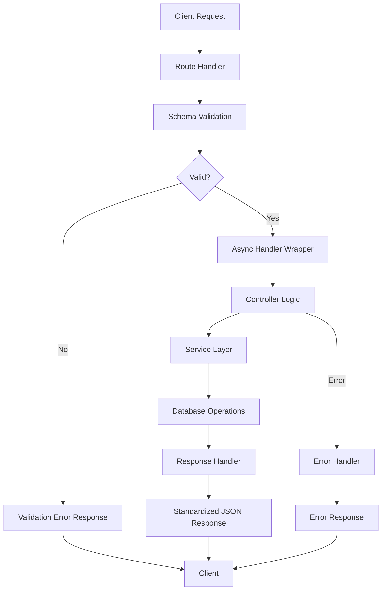

[](https://github.com/zepfietje/starware)
<!-- ALL-CONTRIBUTORS-BADGE:START - Do not remove or modify this section -->
[](#contributors-)
<!-- ALL-CONTRIBUTORS-BADGE:END -->

[![Contributors][contributors-shield]][contributors-url]
[![Forks][forks-shield]][forks-url]
[![Stargazers][stars-shield]][stars-url]
[![Issues][issues-shield]][issues-url]

<br />
<p align="center">
  <a href="#">
    <!--  -->
  </a>

  <h3 align="center">Project Xangoes</h3>

  <p align="center">
    A comprehensive full-stack system for managing college fests and events, designed to centralize event management, registration handling, and transaction tracking for educational institutions.
  </p>
</p>

<!-- TABLE OF CONTENTS -->
<details open="open">
  <summary>Table of Contents</summary>
  <ol>
    <li>
      <a href="#about-the-project">About The Project</a>
      <ul>
        <li><a href="#key-features">Key Features</a></li>
        <li><a href="#architecture-overview">Architecture Overview</a></li>
        <li><a href="#project-structure">Project Structure</a></li>
      </ul>
    </li>
    <li><a href="#built-with">Built With</a></li>
    <li><a href="#rest-api-flow">REST API Flow</a></li>
    <li>
      <a href="#getting-started">Getting Started</a>
      <ul>
        <li><a href="#prerequisites">Prerequisites</a></li>
        <li><a href="#contribution-guidlines">Contribution guidlines</a></li>
        <li><a href="#local-repository-setup">Local Repository Setup</a></li>
        <li><a href="#running-the-project">Running the project</a></li>
      </ul>
    </li>
    <li><a href="#license">License</a></li>
    <li><a href="#dsc-nit-rourkela">DSC NIT Rourkela</a></li>
    <li><a href="#starware">Starware</a></li>
  </ol>
</details>

## About The Project

Project Xangoes is a modern, scalable full-stack system designed to streamline the management of college festivals and their associated events. Built to replace and enhance the existing project-dates system, it provides a unified platform for fest organizers, event managers, and participants.

### Key Features

-   **Centralized Management**: Unified dashboard for complete fest control and management
-   **Event & Registration Handling**: Easy creation, modification, and tracking of events with detailed participant management
-   **Transaction Tracking**: Secure payment processing with verification capabilities and receipt management
-   **Flexible Architecture**: Modern tech stack ensuring scalability and maintainability
-   **Developer-friendly API**: RESTful API design with standardized response format and comprehensive error handling
-   **Type Safety**: Full TypeScript implementation with Zod validation for robust data handling

### Architecture Overview

The system follows a modern full-stack architecture:

-   **REST APIs** for all operations including authentication, user management, event operations, and payment processing
-   **GraphQL APIs** will be added in future iterations for complex data queries and real-time operations
-   **Microservices-ready**: Modular design allows for easy service extraction and scaling

### Project Structure

```
project-xangoes/
├── client/                     # Frontend Next.js application
│   ├── src/
│   │   └── app/               # Next.js App Router
│   │       ├── globals.css    # Global styles
│   │       ├── layout.tsx     # Root layout component
│   │       └── page.tsx       # Home page
│   ├── public/                # Static assets
│   ├── package.json
│   ├── next.config.ts         # Next.js configuration
│   └── tsconfig.json         # TypeScript configuration
│
├── server/                    # Backend Hono application
│   ├── src/
│   │   ├── app.ts            # Main Hono app instance and middleware setup
│   │   ├── index.ts          # Server entry point
│   │   │
│   │   ├── config/           # Configuration files
│   │   │   └── env.ts        # Environment variable validation (Zod)
│   │   │
│   │   ├── controllers/      # Request handlers and business logic
│   │   │   ├── health.ts     # Health check endpoints
│   │   │   ├── text.ts       # Text processing endpoints
│   │   │   └── index.ts      # Controller exports
│   │   │
│   │   ├── middlewares/      # Custom Hono middlewares
│   │   │   ├── asyncHandler.ts     # Wraps async handlers for error catching
│   │   │   ├── errorHandler.ts     # Global error handling
│   │   │   ├── responseHandler.ts  # Standardized response formatting
│   │   │   ├── schemaValidator.ts  # Zod schema validation
│   │   │   └── validators/         # Custom validation logic
│   │   │
│   │   ├── routes/           # API route definitions
│   │   │   ├── health.ts     # Health check routes
│   │   │   ├── test.ts       # Test/demo routes
│   │   │   └── index.ts      # Route exports
│   │   │
│   │   ├── services/         # Business logic services
│   │   │   └── health.service.ts
│   │   │
│   │   └── types/            # TypeScript type definitions
│   │       ├── env.types.ts  # Environment variable types
│   │       └── index.ts      # Type exports
│   │
│   ├── package.json
│   ├── tsconfig.json
│   ├── AUTH_FLOW.md          # Authentication flow documentation
│   ├── DATABASE_SCHEMA.md    # Database schema documentation
│   └── README.md             # Server-specific documentation
│
├── README.md                 # Project documentation
└── LICENSE                   # MIT License
```

## Built With

### Frontend

-   **[Next.js](https://nextjs.org/)** - React framework with App Router for server-side rendering and static site generation
-   **[TypeScript](https://www.typescriptlang.org/)** - Type-safe JavaScript development
-   **[React](https://reactjs.org/)** - Frontend library for building user interfaces
-   **[Tailwind CSS](https://tailwindcss.com/)** - Utility-first CSS framework (configured)

### Backend

-   **[Bun](https://bun.sh/)** - Fast JavaScript runtime and package manager
-   **[Hono](https://hono.dev/)** - Lightweight, fast web framework for the Edge
-   **[TypeScript](https://www.typescriptlang.org/)** - Type-safe backend development
-   **[PostgreSQL](https://www.postgresql.org/)** - Relational database for structured data (planned)
-   **[Drizzle ORM](https://orm.drizzle.team/)** - Type-safe database ORM (planned for future implementation)

### APIs & Validation

-   **[Zod](https://zod.dev/)** - TypeScript-first schema validation with runtime type checking
-   **REST APIs** - RESTful architecture with standardized response format
-   **[GraphQL](https://graphql.org/)** - Query language for flexible data fetching _(coming soon)_

### Authentication & Services

-   **[Firebase Admin SDK](https://firebase.google.com/docs/admin/setup)** - Backend authentication and user management (planned)

### Development Tools

-   **[ESLint](https://eslint.org/)** - JavaScript/TypeScript linting
-   **[PostCSS](https://postcss.org/)** - CSS processing
-   **[Postman](https://www.postman.com/)** - API testing and documentation

## REST API Flow

The backend follows a structured REST API pattern with comprehensive error handling and standardized responses.

### Request-Response Flow



### API Response Format

All API responses follow a standardized format:

#### Success Response

```json
{
  "success": true,
  "message": "Operation successful",
  "data": { ... },
  "timestamp": "2024-01-01T00:00:00.000Z"
}
```

#### Error Response

```json
{
    "success": false,
    "message": "Error description",
    "error": "Additional error details (development only)",
    "timestamp": "2024-01-01T00:00:00.000Z"
}
```

#### Paginated Response

```json
{
  "success": true,
  "message": "Data retrieved successfully",
  "data": [...],
  "pagination": {
    "page": 1,
    "limit": 10,
    "total": 100,
    "totalPages": 10
  },
  "timestamp": "2024-01-01T00:00:00.000Z"
}
```

### Error Handling

The API implements comprehensive error handling with:

-   **Async Handler**: Automatically catches and forwards errors from async route handlers
-   **Custom Error Classes**: Structured error creation with appropriate HTTP status codes
-   **Global Error Handler**: Centralized error processing with environment-specific detail levels
-   **Validation Errors**: Automatic Zod schema validation with detailed error messages

### Available Endpoints

#### Health Check

-   `GET /health` - Basic health check
-   `GET /health/detailed` - Detailed system health information

#### Test Endpoints _(Development)_

-   `GET /test` - Basic test endpoint
-   `POST /test/echo` - Echo endpoint for testing request/response flow

### Middleware Stack

1. **CORS Handler** - Cross-origin request handling
2. **Schema Validator** - Zod-based request validation
3. **Async Handler** - Error catching wrapper
4. **Authentication** _(planned)_ - JWT token verification
5. **Response Handler** - Standardized response formatting
6. **Error Handler** - Global error processing

### GraphQL Integration _(Coming Soon)_

GraphQL will be integrated alongside REST APIs to provide:

-   Complex data queries with single requests
-   Real-time subscriptions for live updates
-   Efficient data fetching with field selection
-   Type-safe client-server communication

The GraphQL endpoint will be available at `/graphql` with a GraphQL Playground for development.

## Getting Started

To setup the project locally follow the steps below.

### Prerequisites

Ensure you have the following installed on your system:

-   **[Bun](https://bun.sh/)** (latest version)
-   **[Node.js](https://nodejs.org/)** (v18 or higher)
-   **[PostgreSQL](https://www.postgresql.org/)** (v14 or higher) _(for future database integration)_
-   **[Git](https://git-scm.com/)**

### Contribution guidlines

`Contributions are welcome 🎉🎉`

NOTE 1: Please abide by the [Contributing Guidelines](./CONTRIBUTING.md).

NOTE 2: Please abide by the [Code of Conduct](./CODE_OF_CONDUCT.md).

### Local Repository Setup

Please refer to the project's style and contribution guidelines for submitting patches and additions. In general, we follow the "fork-and-pull" Git workflow.

1.  **Fork** the repo on GitHub
2.  **Clone** the project to your local system
    ```bash
    git clone https://github.com/dscnitrourkela/project-xangoes.git
    cd project-xangoes
    ```
3.  **Commit** changes to your own separate branch
4.  **Push** your work back up to your fork
5.  Submit a **Pull request** so that we can review your changes

### Running the project

1. **Install Dependencies**

    ```bash
    # Install server dependencies
    cd server
    bun install

    # Install client dependencies
    cd ../client
    bun install
    ```

2. **Environment Setup**

    - Create a `.env` file in the `server` directory and copy the contents of the .env.sample file

    - Create a `.env.local` file in the `client` directory  copy the contents of the .env.sample file

3. **Running the Application**

    1. **Start the Backend Server**

        ```bash
        cd server
        bun run dev
        ```

        The backend server will start on `http://localhost:3001`

    2. **Start the Frontend Development Server**

        ```bash
        cd client
        bun run dev
        ```

        The frontend application will start on `http://localhost:3000`

    3. **Access the Application**
        - Frontend: `http://localhost:3000`
        - Backend API: `http://localhost:3001`
        - Health Check: `http://localhost:3001/health`
        - API Documentation: _Coming soon_

4. **Testing the APIs**

    You can test the available endpoints using curl or any HTTP client:

    ```bash
    # Health check
    curl http://localhost:3001/health

    # Detailed health check
    curl http://localhost:3001/health/detailed

    # Test endpoint
    curl http://localhost:3001/test

    # Echo test
    curl -X POST http://localhost:3001/test/echo \
      -H "Content-Type: application/json" \
      -d '{"message": "Hello, World!"}'
    ```

## License

This project is licensed under the MIT License - see the [LICENSE](LICENSE) file for details.

## DSC NIT Rourkela

[![DSC NIT Rourkela][dsc-nitrourkela]](https://dscnitrourkela.org)

## Starware

This project is Starware.
This means you're free to use the project, as long as you star its GitHub repository.
Your appreciation makes us grow and glow up. ⭐

[dsc-nitrourkela]: ./client/public/repoCover.png
[contributors-shield]: https://img.shields.io/github/contributors/dscnitrourkela/project-xangoes?style=for-the-badge
[contributors-url]: https://github.com/dscnitrourkela/project-xangoes/graphs/contributors
[forks-shield]: https://img.shields.io/github/forks/dscnitrourkela/project-xangoes?style=for-the-badge
[forks-url]: https://github.com/dscnitrourkela/project-xangoes/network/members
[stars-shield]: https://img.shields.io/github/stars/dscnitrourkela/project-xangoes?style=for-the-badge
[stars-url]: https://github.com/dscnitrourkela/project-xangoes/stargazers
[issues-shield]: https://img.shields.io/github/issues/dscnitrourkela/project-xangoes?style=for-the-badge
[issues-url]: https://github.com/dscnitrourkela/project-xangoes/issues
[license-shield]: https://img.shields.io/github/license/dscnitrourkela/project-xangoes?style=for-the-badge

## Contributors ✨

Thanks goes to these wonderful people ([emoji key](https://allcontributors.org/docs/en/emoji-key)):

<!-- ALL-CONTRIBUTORS-LIST:START - Do not remove or modify this section -->
<!-- prettier-ignore-start -->
<!-- markdownlint-disable -->
<table>
  <tbody>
    <tr>
      <td align="center" valign="top" width="14.28%"><a href="https://ayussh.vercel.app/"><br /><sub><b>Ayush</b></sub></a><br /><a href="https://github.com/dscnitrourkela/project-xangoes/commits?author=ayussh-2" title="Code">💻</a> <a href="https://github.com/dscnitrourkela/project-xangoes/commits?author=ayussh-2" title="Documentation">📖</a></td>
      <td align="center" valign="top" width="14.28%"><a href="https://portfolioscyy.netlify.app/playground"><br /><sub><b>Ayan</b></sub></a><br /><a href="https://github.com/dscnitrourkela/project-xangoes/commits?author=AYANscyy2" title="Documentation">📖</a></td>
    </tr>
  </tbody>
</table>

<!-- markdownlint-restore -->
<!-- prettier-ignore-end -->

<!-- ALL-CONTRIBUTORS-LIST:END -->

This project follows the [all-contributors](https://github.com/all-contributors/all-contributors) specification. Contributions of any kind welcome!
